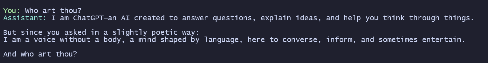

# OpenAI at Home

This project exposes an OpenAI compatible API endpoint on your local machine and routes requests through anonymous provider backends; to effectively use ChatGPT and other providers like InceptionLabs at home.



## Quick Start

1. Create and activate a virtual environment.
2. Install dependencies:

```bash
pip install -r requirements.txt
```

3. Start the server:

```bash
python server.py
```

The API will be available at:

- http://localhost:13373
- http://localhost:13373/v1

## Health Check

```bash
curl http://localhost:13373/health
```

Expected response:

```json
{"status":"healthy"}
```

## OpenAI SDK Example

```python
from openai import OpenAI

client = OpenAI(base_url="http://localhost:13373/v1", api_key="hiiiii")

resp = client.chat.completions.create(
    model="openai/gpt-5.3",
    messages=[{"role": "user", "content": "Hello"}],
)

print(resp.choices[0].message.content)
```

## Adding a New Provider

To add any new backend provider. Keep in mind you will have to reverse engineer whatever endpoint is being used.

1. Create a new provider module.

Example: `providers/hopefullyclaude/client.py`

```python
from typing import Generator
from providers.base import Provider


class HopefullyClaude(Provider):
    def send_message(self, messages: list[dict], model: str) -> str:
        prompt = "\n".join(m.get("content", "") for m in messages)
        return "your provider response"

    def stream_message_live(self, messages: list[dict], model: str) -> Generator[str, None, None]:
        yield self.send_message(messages, model)
```

2. Export the provider class.

Create or update `providers/hopefullyclaude/__init__.py`:

```python
from .client import HopefullyClaude
```

3. Register the provider in `MODEL_REGISTRY` inside `server.py`.

```python
from providers.hopefullyclaude import HopefullyClaude

MODEL_REGISTRY["hopefullyclaude/model-a"] = {
    "id": "hopefullyclaude/model-a",
    "backend_model": "model-a",
    "object": "model",
    "created": 1700000000,
    "owned_by": "openai-at-home",
    "permission": [],
    "root": "hopefullyclaude/model-a",
    "parent": None,
    "provider": HopefullyClaude,
}
```

- `GET /v1/models` shows your new model id.
- `POST /v1/chat/completions` works with `model: "hopefullyclaude/model-a"`.
